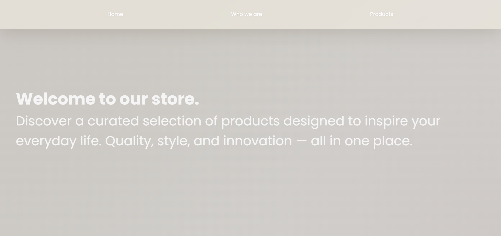
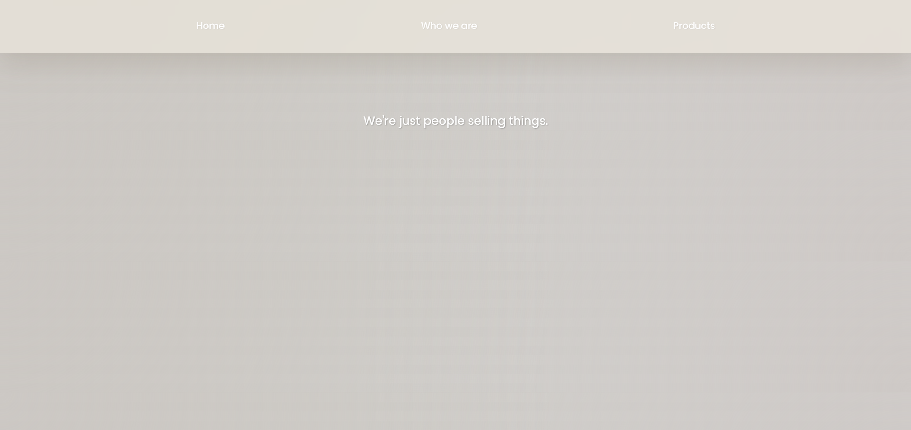
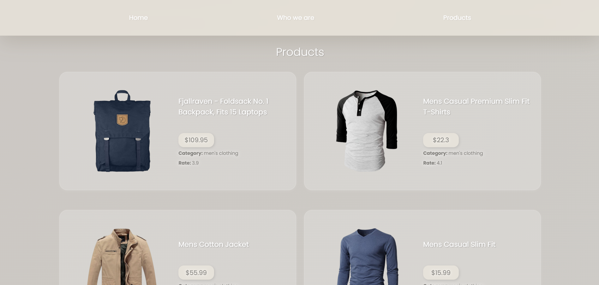
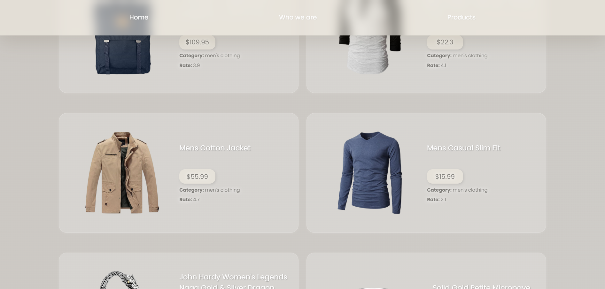
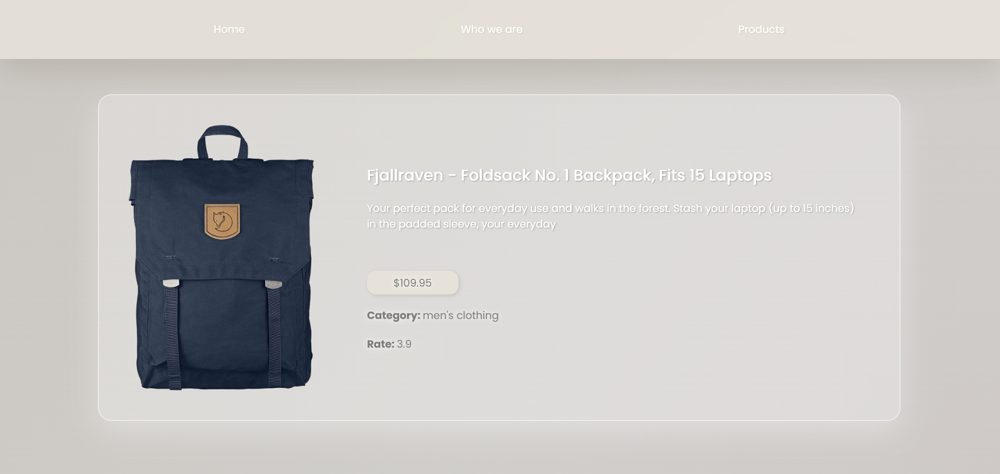

# react-router

## 🇬🇧 English Version

### Overview

React exercise focused on building the frontend of a small e-commerce with React Router, using Fake Store API as a fake backend to load products and their details.

### Assignment Summary

The assignment required to:

- Create a new React application for a mini e-commerce.
- Install React Router DOM:
  - `npm i react-router-dom`
- Define at least three main pages:
  - Homepage with a welcome message or promotional image.
  - “About us” page.
  - “Products” page that retrieves and displays the product list from:
    - `https://fakestoreapi.com/products`
- Implement a Navbar visible on all pages to navigate between the main sections.
- Make each product on the Products page clickable using `<Link>`.
- Add a product detail page that shows information for a single product, loading data from:
  - `https://fakestoreapi.com/products/:id`
- Configure dynamic routing so that the product ID is read from the URL.

---

## 🇮🇹 Versione Italiana

### Panoramica

Esercizio React dedicato alla realizzazione del frontend di un mini e-commerce con React Router, utilizzando Fake Store API come backend fittizio per i prodotti e le loro pagine di dettaglio.

### Riassunto della Consegna

La consegna richiedeva di:

- Creare una nuova applicazione React per un mini e-commerce.
- Installare React Router DOM:
  - `npm i react-router-dom`
- Definire almeno tre pagine principali:
  - Homepage con un messaggio di benvenuto o un’immagine promozionale.
  - Pagina “Chi siamo”.
  - Pagina “Prodotti” che recuperi e mostri la lista dei prodotti da:
    - `https://fakestoreapi.com/products`
- Implementare una Navbar visibile in tutte le pagine per navigare tra le sezioni principali.
- Rendere ogni prodotto della pagina Prodotti cliccabile utilizzando `<Link>`.
- Aggiungere una pagina di dettaglio per ogni prodotto, con le informazioni caricate da:
  - `https://fakestoreapi.com/products/:id`
- Configurare un routing dinamico che legga l’ID del prodotto dalla URL.
